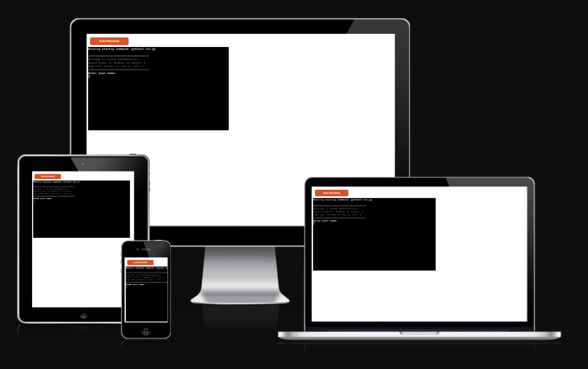
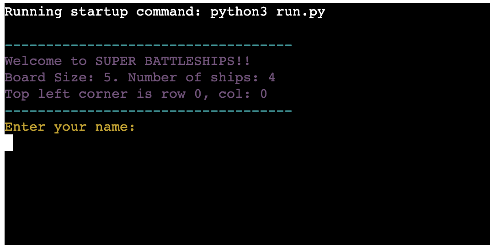

# README FOR BATTLESHIPS GAME

## CONTENTS
- [CONTENTS](#contents)
- [Description](#description)
- [How to Play](#how-to-play)
- [Features of the game](#features-of-the-game)
    + [Existing Features](#existing-features)
    + [Features for the future](#features-for-the-future)
- [Data Model](#data-model)
- [Testing](#)

Welcome to the Super battleships game, a Python terminal game.

## Description
The Battleships game is a classic two-player board game where each player tries to sink the opponent's fleet of ships. Players take turns guessing the coordinates of the opponent's ships on a grid. The first player to sink all of the opponent's ships wins the game.

This Battleships game offers a modern twist on the traditional gameplay. With vibrant colors and visually appealing graphics, players are immersed in an immersive and captivating gaming environment. The use of the `termcolor` library allows for colorful and eye-catching text, adding an extra layer of excitement to the gameplay.

Furthermore, this game provides a user-friendly interface, making it accessible to players of all ages and skill levels. Whether you are a seasoned Battleships player or new to the game, our intuitive design ensures a seamless and enjoyable gaming experience.

The purpose of playing Battleships is to challenge your strategic thinking and decision-making skills. By carefully selecting coordinates and anticipating your opponent's moves, you can strategically position your shots to sink their fleet. The thrill of successfully hitting an opponent's ship and the suspense of avoiding enemy fire make Battleships a highly engaging and addictive game.

With its visually appealing design, user-friendly interface, and exciting gameplay, this Battleships game is sure to attract players who seek an immersive and captivating gaming experience. So, gather your friends, family, or challenge the computer, and embark on an epic naval battle that will keep you entertained.

## How to Play
To play the game:
1. Enter your name when prompted.
2. The game will display both the player's board and the computer's board.
3. The player will take turns guessing the coordinates to attack the computer's ships.
4. Enter the x and y coordinates for your guess when prompted.
5. The game will indicate whether the guess was a hit or a miss.
6. The computer will then take its turn and randomly guess coordinates on the player's board.
7. The game will display the updated scores and the boards after each round.
8. Continue taking turns until either the player or the computer sinks all the ships.
9. The game will declare the winner and display the final scores.

## Features of the game

### Existing Features
- The player's name is entered at the beginning of the game.
    + Player must enter name to play the game

- Random Board generation
    + The game initializes with a board size of 5x5 and 4 ships for both the player and the computer.
    + The player cannot see the coordinates or positions of the computer's ships.
- The player and the computer take turns guessing coordinates to attack each other's ships.
- The game validates the input coordinates and checks if the guess has already been made.
- The game randomly places the computer's fleet of ships on the board.

- The game updates the scores and displays the boards after each round.

- The game allows the player to start a new game or quit after each round.

- Game completion with a congratulation message to the winner.

### Features for the future
- Different Game Modes: Introduce different game modes to vary the gameplay experience. For example, a timed mode where players have to sink all the opponent's ships within a specific time limit, or a survival mode where players have a limited number of guesses to sink as many ships as possible.
- Multiplayer Mode: Implement a multiplayer mode that allows players to compete against each other online. This could involve real-time gameplay or turn-based matches with friends or random opponents.
- Power-Ups: Introduce power-ups that players can collect to gain advantages during the game. For example, a power-up could reveal a portion of the opponent's board or provide an extra guess.

## Data Model
The data model of the Supper Battleships Python game consists of the following components:

1. `scores`: A dictionary that keeps track of the scores for the computer and player.

2. `Board` class: Represents the game board. It has attributes such as size, board grid, number of ships, name, type, guesses, and ships. It also has methods for printing the board, adding ships, generating computer's guess, taking user's guess, validating coordinates, and checking if a guess is valid.

3. `populate_board` function: Populates the board with ships.

4. `make_guess` function: Makes a guess on the board and updates the scores.

5. `play_game` function: Plays the game by alternating turns between the computer and the player.

6. `start_new_game` function: Starts a new game by setting the board size, number of ships, resetting the scores, and initializing the boards. It also handles the game flow and allows the player to continue or quit.

Overall, the data model includes the necessary components to manage the game state, handle user input, and perform game logic.

## Testing

**TEST** | **ACTION** | **EXPECTATION** | **RESULT** 
----------|----------|----------|----------
Input - Show instructions -  Invalid data | Entered in : blank space, return key, symbols, numbers	| app informs user of invalid data & prompts the user Invalid input. Please enter 'yes' or 'no'.| Works as expected
Input - Show instructions - Valid data	| Entered in : characters in scope | app proceeds to next function | Works as expected
Input - User name - Invalid data	| Entered in : blank space, return key, symbols, numbers	| app informs user of invalid data & prompts the user Please enter alphabetic characters only.| Works as expected
Input - User name - Valid data	| Entered in : characters in scope | app proceeds to next function | Works as expected
Input - Enter the x-coordinate (0-4):, Enter the y-coordinate (0-4): - Invalid data	| Entered in : blank space, return key, symbols, numbers	| app informs user of invalid data & prompts the user nvalid guess. Try again or Invalid input. Please enter valid coordinates if a string is entered.| Works as expected
Input -  Enter the x-coordinate (0-4):, Enter the y-coordinate (0-4): characters in scope | app proceeds to next function | Works as expected
Input - Choice input to continue or exit -  Any key to continue | Entered in : blank space or any key, return key, symbols, numbers	| app Continues to the next stage of the gam.| Works as expected
Input - Choice input n key to exit - Valid data	| Entered in : 'n' to exit game | app proceeds to next function | Works as expected
Input - Play again -  Invalid data | Entered in : blank space or any thing apart fron yes/no, return key, symbols, numbers	| app informs user of invalid data & prompts the user Invalid input. | Works as expected
Input - Show instructions - Valid data	| Entered in : yes/no | app proceeds to next function | Works as expected

- The codes were passed through PEP8 and correction made to make sure there are no more errors.

### Bugs
This is how bugs were solved:
- In the code writing and testing process, I was getting issues with not printing the computer's board and this was resolved with print computer board statement under the make_guess function.
- Coordinate validation: I had issue with coordinate guessing as player was able to repeat coordinates is_valid_guess method in the board class.

### Validator Testing
- PEP8
    + No errors returned from PEP8online.com

## Deployment
The project was deployed using Code Institute's mock terminal for Heroku.

- Deployment steps:
    + Final processes including making sure that requirments.txt to list all installed extension are captured and pushed to repository.
    + The repository was forked.
    + A new app was selected in the Heroku platform to create a new app.
    + The buildpacks were set with Python and NodeJS in that order.
    + The Heroku app was linked to the repository.
    + The app was deployed by cliking view.

- [The deployment link is](#https://super-battleships-game-0f566b0f59ef.herokuapp.com/)

## Credits
- Code Institute for the deployment terminal and also the Python repository template in gitHub.
- Wikepedia for the details for the Battelship game.
- Google, and ChatGPT from Open AI for editing of codes.
- My mentor, Lauren-Nicole for valuable imputs on approach from the start of the project.

